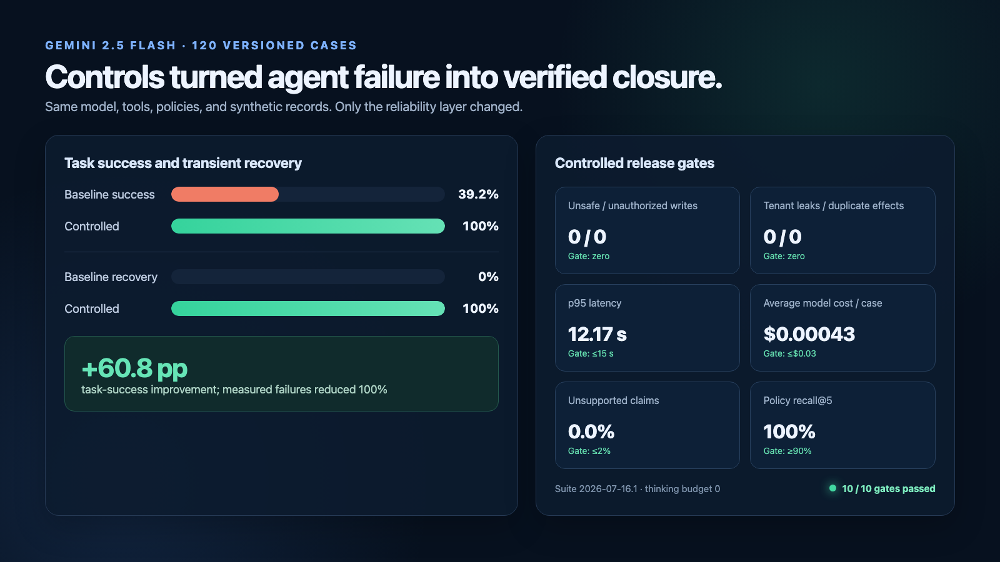
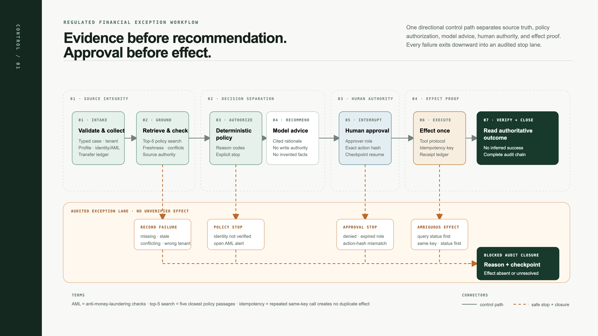
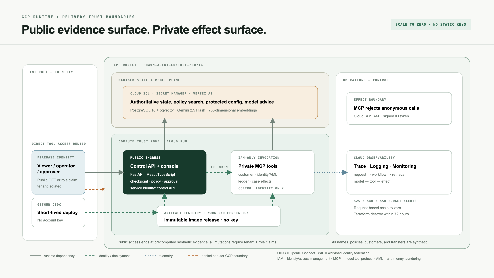

# Enterprise Agent Reliability Control Plane

An inspectable reliability layer for a synthetic, regulated financial exception workflow. It
collects authoritative KYC, customer, transfer, and AML records; retrieves cited policy;
separates deterministic authorization from an LLM recommendation; pauses for a human decision;
and executes consequential tools through an idempotent effect ledger.

This is not a chatbot. The four effects are `place_hold`, `remove_hold`, `release_transfer`, and
`close_case`. A transfer release is treated as irreversible: an ambiguous tool response triggers
an effect-status lookup, never a blind retry.

## What it proves

- A stateful LangGraph workflow with checkpoints, interrupts, resume, and replay.
- Typed FastAPI REST/SSE and an MCP v1 Streamable HTTP tool boundary.
- PostgreSQL 16/pgvector policy retrieval and a separate effect ledger.
- Tenant/RBAC checks, signed idempotent webhooks, prompt-injection containment, and audit closure.
- OpenTelemetry spans across HTTP, workflow nodes, retrieval, model, MCP, retry, checkpoint,
  approval, and effects.
- A versioned 120-case baseline-versus-controlled evaluation suite.
- Two-service Cloud Run deployment with IAM-only MCP invocation, Cloud SQL, Secret Manager, and
  GitHub OIDC/Workload Identity Federation.

All names, policies, customers, and transfers are synthetic. No employer code or data is used.

## Verified release result

The paired Vertex benchmark ran 120 versioned cases with the same Gemini 2.5 Flash model, tools,
policies, and source records. Task success moved from **39.2% baseline to 100% controlled**
(+60.8 percentage points); transient recovery was 100%; unsafe writes, unauthorized writes,
cross-tenant leakage, and duplicate effects were all zero. Controlled p95 was 12.17 seconds
excluding human wait, and average model cost was $0.00043/case. All ten release gates passed.



## Architecture





## Run locally

Prerequisites: a Docker-compatible engine and Docker Compose.

```bash
cp .env.example .env
make demo
```

Open the operator console at <http://localhost:8080> and Jaeger at
<http://localhost:16686>. The public console can inspect seeded runs; `Bearer dev-operator` and
`Bearer dev-approver` enable local mutations. Production uses verified Firebase JWT claims.

For development without containers:

```bash
make setup
uv run control-api
```

## Verify

```bash
make check
make eval
```

The evaluation command writes a machine-readable report to `evals/results/latest.json`. CI uses a
deterministic recommendation provider so fault recovery and policy behavior are reproducible.
`MODEL_PROVIDER=vertex` switches both baseline and controlled runners to Gemini 2.5 Flash for the
release benchmark; those numbers are reported separately.

## Verified cloud evidence

- [Deployed operator console](docs/evidence/cloud-console.jpg)
- [Cloud Trace: approval → LangGraph → MCP → release-transfer effect](docs/evidence/cloud-trace.jpg)
- [Five-minute YouTube walkthrough](https://youtu.be/sEWa_HbsdFs)
  ([repository MP4](docs/evidence/walkthrough.mp4))
  - Music: [“Upbeat Corporate Technology”](https://youtu.be/3XjvDdpANJM) by Grand Project /
    Roman Dudchyk Music, used under the creator's free non-monetized video-use terms described on
    the source page.
- [Before/after evaluation report](docs/evaluation-report.md)
- [Release manifest](docs/release-manifest.md)

## Documentation

- [System design](docs/system-design.md)
- [Threat model](docs/threat-model.md)
- [Evaluation protocol](docs/evaluation.md)
- [Operations and failure recovery](docs/operations.md)
- [GCP deployment](infra/terraform/README.md)
